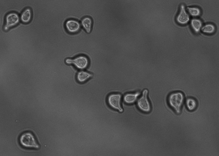
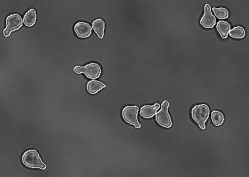
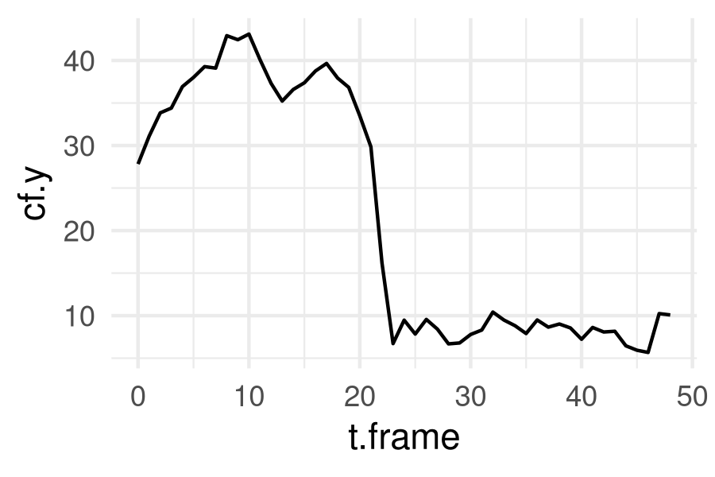

# rcell2

Functions to analyze [Cell-ID](https://github.com/darksideoftheshmoo/cellID-linux)'s single-cell cytometry data in R, using a tidy and shiny framework.

`rcell2`'s functionality is split into four packages:

* The main `rcell2` package offers functions to load Cell-ID's output to data.frames, and image manipulation based on EBImage. <!-- A development version of this package is available in the [`rcell2.dev`](https://github.com/darksideoftheshmoo/rcell2/tree/rcell2.dev) branch. -->
* Cell-ID, the image segmentation software, has been wrapped in the [`rcell2.cellid`](https://github.com/darksideoftheshmoo/rcell2-cellid) package. It offers functions to run CellID from R, and an rmarkdown template showcasing advanced functionality.
* Advanced cytometry tools built on R-Shiny and [magick](https://github.com/ropensci/magick). The [`rcell2.magick`](https://github.com/darksideoftheshmoo/rcell2-magick) package provides tools for single-cell image tiling, and graphic filtering apps. It also includes an rmarkdown template with examples and tutorials.
* The [`rcell2.examples`](https://github.com/darksideoftheshmoo/rcell2.examples) package contains example images (used by the notebook templates in other packages) and notebooks where we've tested several analyis and classification methods.

This package is very well tested in baker's yeast data, and R version 4+.

## Preview

The typical pipeline:

1. Use [`rcell2.cellid`](https://github.com/darksideoftheshmoo/rcell2-cellid) to segment images.
2. Use this package to load the output, and manipulate it using base R or the tidyverse.
3. Use [`rcell2.magick`](https://github.com/darksideoftheshmoo/rcell2-magick) to filter cells graphically with Shiny apps, make single-cell image strips, and advanced plots.

The concept is straightforward: provide a _defocused_ brightfield image to Cell-ID, and _voila_:

 

> Segmentation of yeast cells in a single position.

The image is segmented, cells are identified and tracked over time, and features are computed from morphology and fluorescent signal distribution.


> Time series images of one cell, showing different acquisition channels. 

With Rcell2, you can load an analize the CellID results freely, using standard R packages.



> Background corrected fluorescent signal concentration VS time, plotted with ggplot2.

# Installation

These installation instructions correspond to the `rcell2` package.

To get the full functionality of the rcell2 suite, also install:

* [`rcell2.cellid`](https://github.com/darksideoftheshmoo/rcell2-cellid)
* [`rcell2.magick`](https://github.com/darksideoftheshmoo/rcell2-magick)
* [`rcell2.examples`](https://github.com/darksideoftheshmoo/rcell2.examples)

## R Dependencies

Most of the dependencies are listed in the `DESCRIPTION` file, and should install automatically.

We suggest installing the [```tidyverse```][1] meta-package (and use it, you'll not regret it) and [```devtools```][2]:

```r
install.packages(c("tidyverse", "devtools"))
```

In addition, install [```EBImage```][3] package (required to look at cells) by copying and running the following script:

```r
if (!requireNamespace("BiocManager", quietly = TRUE))
    install.packages("BiocManager")

BiocManager::install("EBImage")
```


<!-- DEPRECATED SECTION: magick was moved to its own package.

Also install `imagemagick` on your system; this is required by R's `magick` package. All the major operating systems are supported by ImageMagick: https://imagemagick.org/script/download.php

For Ubuntu, Arch and macOS (use [homebrew](https://brew.sh/)!!!)  these commands may come in handy:

```sh
# Aptitude
sudo apt install imagemagick

# Pacman
sudo pacman -S imagemagick

```

For macOS see: https://imagemagick.org/script/download.php

## CellID dependency (optional)

The `cell2` function can be used to run CellID directly from R.

It supports newer CellID functions, available at the repo's `mask_mod` branch: https://github.com/darksideoftheshmoo/cellID-linux/tree/mask_mod

Older CellID versions may work, as long as the new options are not enabled.

Visit the CellID repository to get installation instructions.

-->


## Installing the package

Install the packages using `remotes`, directly from the github repos:

```
# rcell2 package
remotes::install_github("darksideoftheshmoo/rcell2")

# cellid package
remotes::install_github("darksideoftheshmoo/rcell2-cellid")

# shiny-magick package
remotes::install_github("darksideoftheshmoo/rcell2-magick")

# rcell2 package
remotes::install_github("darksideoftheshmoo/rcell2")
```

Example data and analysis notebooks can be found in the examples package: [`rcell2.examples`](https://github.com/darksideoftheshmoo/rcell2.examples/tree/main).

# New tools

## CellID bundled in R

This feature is available in the new [`rcell2.cellid`](https://github.com/darksideoftheshmoo/rcell2-cellid) package.

* This package bundles, compiles and wraps our improved Cell-ID binary.
* Save, load and manipulate cell masks and boundaries within R.
* Run it in parallel automagically, backed by R's `foreach`.
* Automate scanning parameter ranges, by running Cell-ID programatically.

## R-Shiny tools for cytometry data

This feature is available in the new [`rcell2.magick`](https://github.com/darksideoftheshmoo/rcell2-magick) package.


* R-Shiny apps will help users filter data graphically, with live image previews.
* Single-cell visualization and image plotting tools, based on [magick](https://github.com/ropensci/magick):
  * Read single cells images of any channels into `magick` objects.
  * You may use any of `magick`'s functions to manipulate these images.
  * Create 1D-tiles and 2D-mosaics of single cells, time courses, of one or many imaging/fluorescence channels.
  * Plot of a 2D grid of "representative" single cell images in a scatterplot (similar to EBImage). Implemented in functions: cellSpread, cellSpreadPlot, and "Pics" type plot in shinyCell.

The graphical filter in this app is general purpose (i.e. useful in standard cell cytometry), and the image-manipulation feature is tailored for data from fluorescence microscopy experiments.

<!-- DEPRECATED SECTION: magick was moved to its own package.

* Several image-manipulation functions, , can generate single-cell tiles and 2D-binned scatter plots, with sample images of single cells on each bin.

There is also another small app to "tag" single cells in the dataset with user defined options.

New functions based on the `magick` package help build image tiles and strips of individual cells.

See:

* `?rcell2::magickCell()`
* `?rcell2::cellStrips()`
* `?rcell2::cellSpreadPlot()`
* `?rcell2::shinyCell()`
* `?rcell2::tagCell()`
* `?rcell2::plotApp()`

-->

## Hu Moment functions for raw cell segmentation data

We implemented the `Hu moments` descriptors in R, and use them on masks generated by CellID. Note that the masks must be generated by the the CellID [`mask_mod` branch](https://github.com/darksideoftheshmoo/cellID-linux/tree/mask_mod) either by TSV output or by encoding CellIDs in the pixel intensities of boundary and/or interior points.

Use the [`rcell.cellid`](https://github.com/darksideoftheshmoo/rcell2-cellid) package to generate the required input.


## K-means filtering functions

The kmeans algotrithm helps filter cells based on clustering of CellID's variables computed from morphological and fluorescence information.

Use k-means and check out images of cells in each cluster. Then, filter them easily by cluster number.

See: `?rcell2::kmeans_clustering`


## Development notebooks

Example image datasets and analysis notebooks can be found in the rcell2 examples companion package: [`rcell2.examples`](https://github.com/darksideoftheshmoo/rcell2.examples/tree/main).

The `extdata/testings` directory holds many rmarkdown notebooks, where we explore different analysis approaches to single cell images and cytometry:

* Spatial distribution of fluorescent signals.
* Pattern detection in time-series.
* Classification examples.
* Cell boundary curvature analysis and alignment.
* ...


# Todo

* ~~Plot of a 2D grid of "representative" single cell images in a scatterplot (similar to EBImage).~~ Implemented in rcell2.magick`: cellSpread, cellSpreadPlot, and "Pics" type plot in shinyCell.
* ~~Generic shiny function for filtering points in a custom ggplot~~. Implemented in rcell2.magick`: plotApp.
* 1D / histogram filtering support in the filtering app.
* Per-facet filtering in shinyCell.
* cellStrips support in shinyCell image viewer.


[1]:https://www.tidyverse.org/
[2]:https://github.com/r-lib/devtools
[3]:https://bioconductor.org/packages/release/bioc/html/EBImage.html
