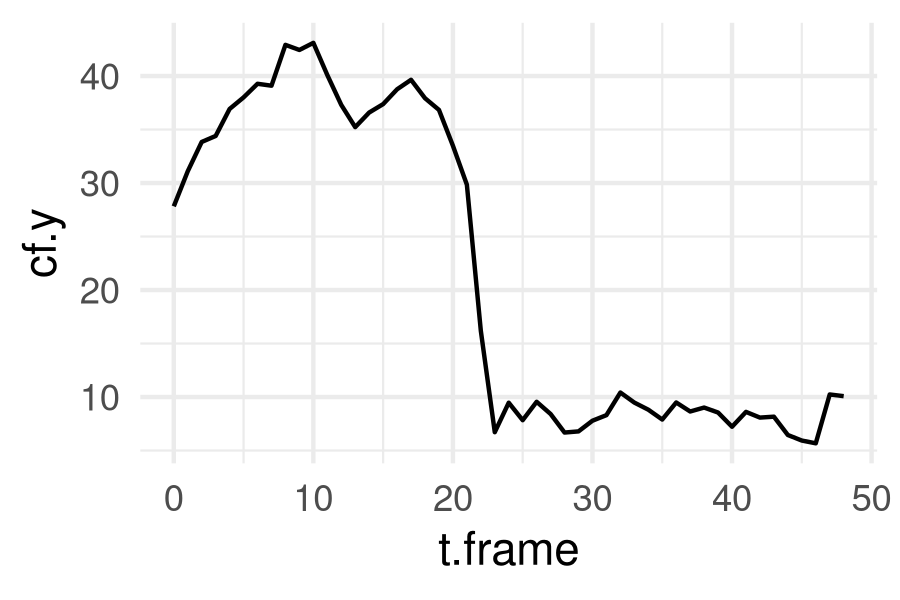

# rcell2

Functions to analyze [Cell-ID](https://github.com/darksideoftheshmoo/cellID-linux)'s single-cell cytometry data in R, using a tidy and shiny framework.

Cell-ID, the image segmentation software, has been wrapped in the [`rcell.cellid`](https://github.com/darksideoftheshmoo/rcell2/tree/rcell2.cellid) package.

The graphic filtering apps, built on R-Shiny and magick, are available in the [`rcell.magick`](https://github.com/darksideoftheshmoo/rcell2/tree/rcell2.magick) package.

The [`rcell2.examples`](https://github.com/darksideoftheshmoo/rcell2.examples) package contains notebooks on general usage, and on several classification and analysis methods.

A development version of this package is available in the [`rcell.dev`](https://github.com/darksideoftheshmoo/rcell2/tree/rcell2.dev) branch.

This package is very well tested in baker's yeast data, and R version 4+.

## Preview

Provide a _defocused_ brightfield image to CellID, and _voila_:

 

> Segmentation of yeast cells in a single position.

The image is segmented, cells are identified and tracked over time, and features are computed from morphology and fluorescent signal distribution.


> Time series images of one cell, showing different acquisition channels. 

With Rcell2, you can load an analize the CellID results freely, using standard R packages.



> Background corrected fluorescent signal concentration VS time, plotted with ggplot2.


# Installation

## Dependencies

Most of the dependencies are listed in the `DESCRIPTION` file, and should install automatically.

We suggest installing the [```tidyverse```][1] meta-package (and use it, you'll not regret it) and [```devtools```][2]:

```r
install.packages(c("tidyverse", "devtools"))
```

In addition, install [```EBImage```][3] package (required to look at cells) by copying and running the following script:

```r
if (!requireNamespace("BiocManager", quietly = TRUE))
    install.packages("BiocManager")

BiocManager::install("EBImage")
```

<!-- DEPRECATED SECTION: magick was moved to its own package.

Also install `imagemagick` on your system; this is required by R's `magick` package. All the major operating systems are supported by ImageMagick: https://imagemagick.org/script/download.php

For Ubuntu, Arch and macOS (use [homebrew](https://brew.sh/)!!!)  these commands may come in handy:

```sh
# Aptitude
sudo apt install imagemagick

# Pacman
sudo pacman -S imagemagick

# macOS homebrew (preferred)
brew install imagemagick

# macOS .dmg
# https://imagemagick.org/script/download.php
```

-->

## Installing the package

Install using `devtools`, directly from github repo:

```r
devtools::install_github("darksideoftheshmoo/rcell2")

devtools::install_github("darksideoftheshmoo/rcell2", ref = "rcell2.dev")  # Development version
```

The _strongly recommended_ additional packages can be installed by following the instructions below.

## Functions to install and run Cell-ID from R

These tools are available in the [`rcell.cellid`](https://github.com/darksideoftheshmoo/rcell2/tree/rcell2.cellid) package.

```r
devtools::install_github("darksideoftheshmoo/rcell2", ref = "rcell2.cellid")  # Cell-ID
```

## R-Shiny and `magick` tools for cytometry data

These tools are available in the [`rcell.magick`](https://github.com/darksideoftheshmoo/rcell2/tree/rcell2.magick) package.

```r
devtools::install_github("darksideoftheshmoo/rcell2", ref = "rcell2.magick")  # Shiny apps and Magick iamges
```

<!-- DEPRECATED SECTION: magick was moved to its own package.

An R-Shiny app will help users filter data graphically, with live image previews.
While the image part may be tailored for data from fluorescence microscopy experiments, the graphical filter in this app is general purpose (i.e. useful in standard cell cytometry).

There is also another small app to "tag" single cells in the dataset with user defined options.

New functions based on the `magick` package help build image tiles and strips of individual cells.

See:

* `?rcell2::magickCell()`
* `?rcell2::cellStrips()`
* `?rcell2::cellSpreadPlot()`
* `?rcell2::shinyCell()`
* `?rcell2::tagCell()`
* `?rcell2::plotApp()`

-->

# New features

## Hu Moment functions for raw cell segmentation data

We implemented the `Hu moments` descriptors in R, and use them on masks generated by CellID. Note that the masks must be generated by the the CellID [`mask_mod` branch](https://github.com/darksideoftheshmoo/cellID-linux/tree/mask_mod) either by TSV output or by encoding CellIDs in the pixel intensities of boundary and/or interior points.

## K-means filtering functions

The kmeans algotrithm helps filter cells based on clustering of CellID's variables computed from morphological and fluorescence information.

Use k-means and check out images of cells in each cluster. Then, filter them easily by cluster number.

See: `?rcell2::kmeans_clustering`

# Todo

* ~~Plot of a 2D grid of "representative" single cell images in a scatterplot (similar to EBImage).~~ Implemented in cellSpread, cellSpreadPlot, and "Pics" type plot in shinyCell.
* ~~Generic shiny function for filtering points in a custom ggplot~~. Implemented in plotApp.
* 1D / histogram filtering support in the filtering app.
* Per-facet filtering in shinyCell.
* cellStrips support in shinyCell image viewer.


[1]:https://www.tidyverse.org/
[2]:https://github.com/r-lib/devtools
[3]:https://bioconductor.org/packages/release/bioc/html/EBImage.html
